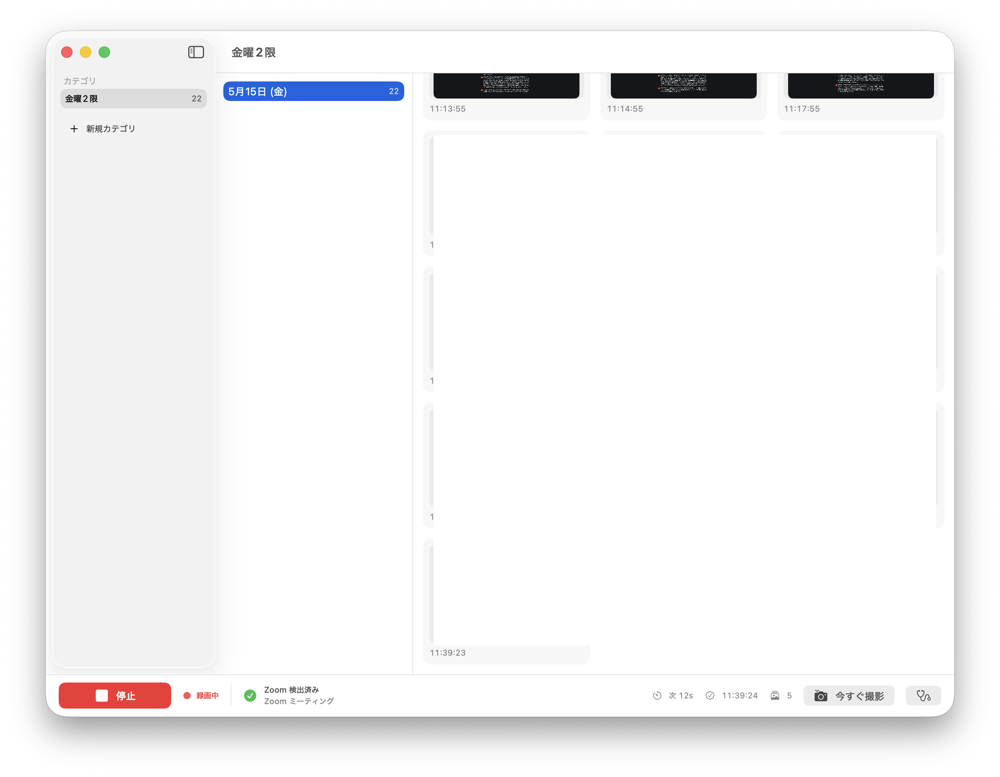

# ZoomRec

Zoom 会議のウィンドウを 60 秒ごとに自動撮影し、曜日 × 限 → 日付 → サムネイルで自動整理する macOS アプリ。授業のスライド説明を後から見返す用途を想定。

- 撮影: ScreenCaptureKit で Zoom ウィンドウ (`us.zoom.*`) を自動検出 → PNG 保存
- 整理: 撮影時刻と曜日から時間割スロット (1〜7 限) を自動判定してカテゴリへ分類
- 補講: スクショ単位／日付単位で別カテゴリへ移動可能
- D&D: サムネイルを他アプリ (Slack / ブラウザ / Finder) へドラッグして PNG 受け渡し
- 字幕: Zoom 音声をリアルタイム文字起こし (Apple 純正 Speech / オンデバイス)。日本語・英語を切替でき、英語時は日本語訳も併記。スクショ機能とは独立して開始／停止可能

対応 OS: macOS 15 Sequoia 以上 (Apple Silicon)



---

## インストール

1. [Releases](https://github.com/hirossan4049/zoomrec/releases/latest) から最新の `ZoomRec-<version>.dmg` をダウンロード
2. DMG をダブルクリックでマウントし、`ZoomRec.app` を **Applications** にドラッグ

### Gatekeeper を通す (署名なしビルドのため初回のみ必要)

本アプリは ad-hoc 署名のため、最初の起動で **「開発元が未確認のため開けません」** と表示されます。以下のいずれかで解除してください。

**ターミナルで一発 (推奨):**

```bash
xattr -dr com.apple.quarantine /Applications/ZoomRec.app
```

これで Quarantine 属性が外れ、以降ダブルクリックで普通に開けます。

**GUI でやる場合:**

- Finder で `ZoomRec.app` を **右クリック → 開く** を 1〜2 回
- または **システム設定 → プライバシーとセキュリティ** で「このまま開く」を選択

### 画面収録の許可

初回起動後、撮影開始ボタンを押した瞬間 (もしくは「今すぐ撮影」⌘K) に macOS の許可ダイアログが出ます。

1. **システム設定 → プライバシーとセキュリティ → 画面収録** を開く
2. リストの **ZoomRec** をオンにする
3. ZoomRec を **完全に終了** (⌘Q) して **再起動** ← これを忘れがち

許可されているのに動かない場合はアプリ右下の **🩺 診断ボタン** を押すと原因切り分け用のレポートが出ます。

---

## 使い方

下部ステータスバーの **撮影開始** (⌘R) を押すと、60 秒ごとに Zoom ウィンドウを撮影します。`今すぐ撮影` (⌘K) で 1 枚だけ即時撮影もできます。

| 操作 | キー / 動作 |
|---|---|
| 撮影開始 / 停止 | `⌘R` |
| 今すぐ 1 枚撮影 | `⌘K` |
| 拡大プレビュー | サムネイルをダブルクリック |
| 全選択 | `⌘A` |
| 選択解除 | `Esc` / 空白をクリック |
| 範囲選択 | サムネイル間の空白からドラッグ |
| 範囲選択 (加算) | `Shift` + ドラッグ |
| 範囲選択 (トグル) | `⌘` + ドラッグ |
| 個別トグル | `⌘` + クリック |
| 範囲拡張 | `Shift` + クリック |
| 削除 | `Delete` キー / 右クリック → 削除 |
| 別カテゴリへ移動 | 右クリック → 別の時限に移動 |

中央カラム (日付一覧) の右クリックメニューから「その日のスクショ N 件を別の時限に移動 / 削除」も可能。補講シナリオに対応。

サイドバーのカテゴリは右クリックで **名前を編集 / 削除**。カスタム名 (例: 「線形代数」) を付けて時間割表示を上書きできます。

---

## データの場所

- 画像: `~/Library/Application Support/zoomrec/images/*.png`
- メタデータ: `~/Library/Application Support/zoomrec/library.json`

画像を Finder などから手動で消しても、次回起動時に library.json から該当エントリが自動で除去されます。

---

## ソースからビルド

```bash
brew install xcodegen
git clone https://github.com/hirossan4049/zoomrec.git
cd zoomrec
xcodegen
open zoomrec.xcodeproj   # Xcode で Run
```

最低要件: Xcode 15+ / macOS 14 SDK

## リリース手順

```bash
./scripts/release.sh 0.2.0              # build → tag → push → gh release
./scripts/release.sh 0.2.0 --no-push    # DMG とタグだけローカル
```

スクリプトが `MARKETING_VERSION` / `CURRENT_PROJECT_VERSION` を bump し、Release ビルド → `hdiutil` で DMG 生成 → `Release v<ver>` でコミット → タグ → `origin` に push → `gh release create` で DMG を添付します。
